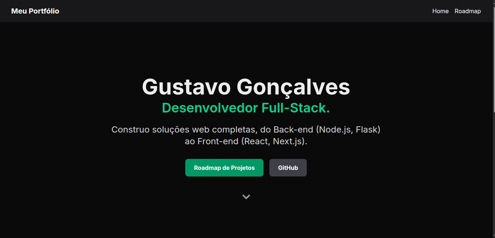
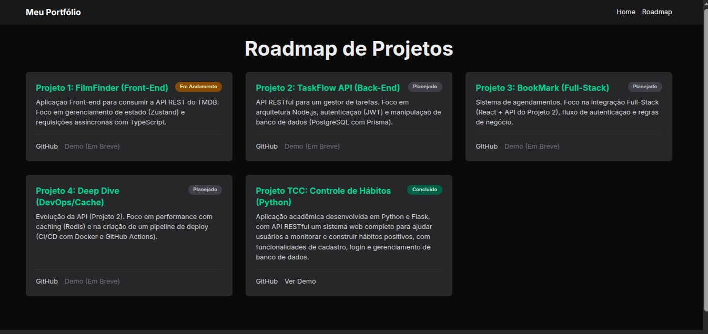

# 🚀 Meu Portfólio Full-Stack (portfolio-hub)

Este é o repositório do meu portfólio pessoal, projetado e construído para ser o hub central da minha jornada como Desenvolvedor Full-Stack.

[](https://[SEU-LINK-DA-VERCEL-AQUI].vercel.app/)

---

## 🎯 Sobre o Projeto

Este não é um portfólio estático. O objetivo principal deste projeto é servir como um **Roadmap Público** do meu aprendizado. A página "Roadmap de Projetos" documenta os projetos que estou construindo, meu progresso e as tecnologias que estou dominando.

O design foi feito com foco em "Mobile-First", e a estrutura segue as melhores práticas do Next.js App Router.

## 📸 Screenshots

Aqui está uma prévia de como o site se parece:

### **Página Home:**


### **Roadmap de Projetos:**


---

## 🛠️ Stack Tecnológica

Este projeto foi construído do zero utilizando as seguintes tecnologias:

* **Framework:** [Next.js (v16)](https://nextjs.org/) (com App Router)
* **Linguagem:** [TypeScript](https://www.typescriptlang.org/)
* **Estilização:** [TailwindCSS (v4)](https://tailwindcss.com/)
* **Componentes:** [React](https://reactjs.org/)
* **Ícones:** [React Icons](https://react-icons.github.io/react-icons/)
* **Hospedagem:** [Vercel](https://vercel.com/)

---

## 🗺️ Roadmap de Projetos

Para ver a lista completa de projetos que estou desenvolvendo (Back-end, Front-end e Full-Stack), acesse a página de roadmap no site.

* **[Acessar o Roadmap de Projetos](https://[SEU-LINK-DA-VERCEL-AQUI].vercel.app/roadmap)**

---

## 🏁 Rodando o Projeto Localmente

Se você quiser rodar este projeto no seu ambiente local, siga os passos abaixo:

1.  **Clone o repositório:**
    ```bash
    git clone [https://github.com/ggsilva10/portfolio-hub.git](https://github.com/ggsilva10/portfolio-hub.git)
    ```

2.  **Entre na pasta do projeto:**
    ```bash
    cd portfolio-hub
    ```

3.  **Instale as dependências:**
    ```bash
    npm install
    ```

4.  **Rode o servidor de desenvolvimento:**
    ```bash
    npm run dev
    ```

5.  Abra [http://localhost:3000](http://localhost:3000) no seu navegador para ver o resultado.
