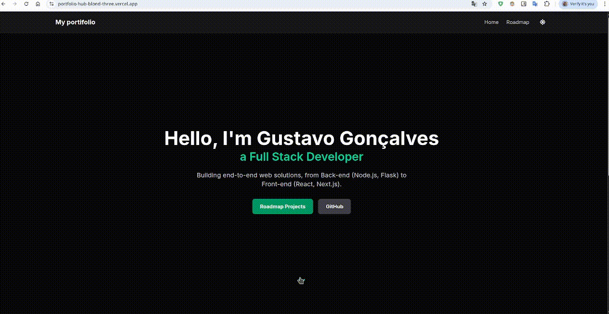
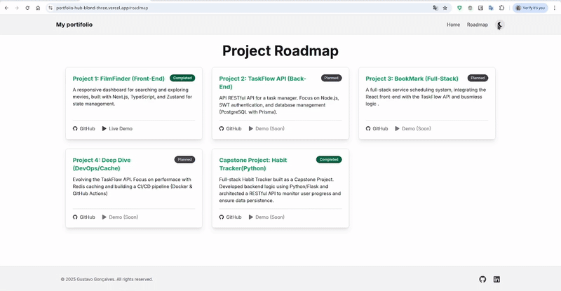

# 🚀 Full-Stack Portfolio (portfolio-hub)

This is the repository for my personal portfolio, designed and built to be the central hub of my journey as a Full-Stack Developer.

[](https://portfolio-hub-blond-three.vercel.app/)

---

## 🎯 About The Project

This is not a static portfolio. The main goal of this project is to serve as a **Public Roadmap** of my learning. The "Project Roadmap" page documents the projects I am building, my progress, and the technologies I am mastering.

The design is fully **responsive** (Mobile-First) and features a **Light/Dark Mode** toggle to ensure a great viewing experience in any lighting condition. The structure follows modern Next.js App Router best practices.

## 📸 Demo & Screenshots

Here is a preview of the site in action, featuring dark mode toggle:

### Home Page (Demo):


### Project Roadmap (Demo):


---

## 🛠️ Tech Stack

This project was built from scratch using the following technologies:

* **Framework:** [Next.js (v16)](https://nextjs.org/) (with App Router)
* **Language:** [TypeScript](https://www.typescriptlang.org/)
* **Styling:** [TailwindCSS (v4)](https://tailwindcss.com/)
* **Components:** [React](https://reactjs.org/)
* **Theme (Dark Mode):** [next-themes](https://github.com/pacocoursey/next-themes)
* **Icons:** [React Icons](https://react-icons.github.io/react-icons/)
* **Deployment:** [Vercel](https://vercel.com/)

---

## 🗺️ Project Roadmap

To see the full list of projects I'm developing (Back-end, Front-end, and Full-Stack), visit the roadmap page on the live site.

* **[View the Project Roadmap](https://portfolio-hub-blond-three.vercel.app/roadmap)**

---

## 🏁 Running The Project Locally

If you want to run this project in your local environment, follow the steps below:

1.  **Clone the repository:**
    ```bash
    git clone [https://github.com/ggsilva10/portfolio-hub.git](https://github.com/ggsilva10/portfolio-hub.git)
    ```

2.  **Enter the project directory:**
    ```bash
    cd portfolio-hub
    ```

3.  **Install the dependencies:**
    ```bash
    npm install
    ```

4.  **Run the development server:**
    ```bash
    npm run dev
    ```

5.  Open [http://localhost:3000](http://localhost:3000) in your browser to see the result.